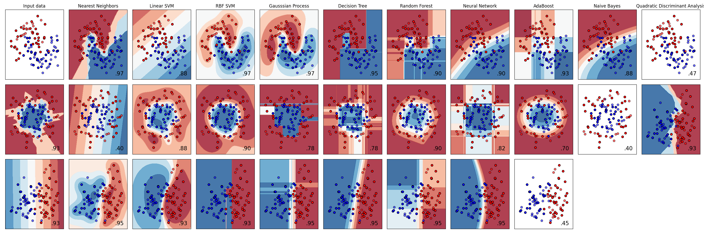

# Machine Learning Algorithms

Some of the most important machine learning algorithms are implemented here:

- K-Nearest Neighbors
- Linear SVM
- RBF SVM
- Gaussian Process
- Decision Tree
- Random Forest
- Neural Network
- AdaBoost
- Naive Bayes
- Quadratic Discriminant Analysis

